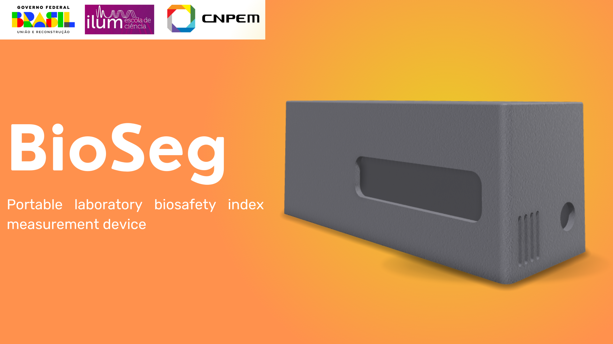
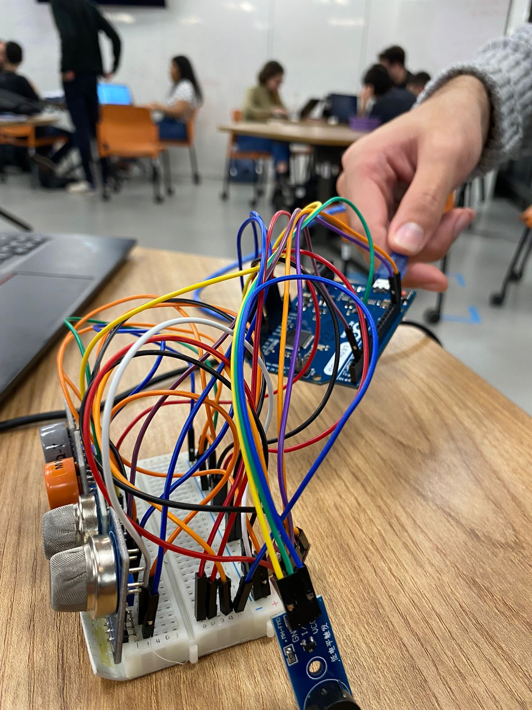

<h2>Medidor de Biosegurança</h2>
<h4>Integrantes: Gabriel González, Geovana Bettero, Gustavo Uchôa, Kayllany Lara da Silva</h4>

Nesse trabalho faremos a construção de um dispositivo para o monitoramento das condições climáticas e de biossegurança do laboratório de ciência da vida. Utilizaremos sensores de gases tóxicos a humanos, que quando tirerem seus níveis de danos aos humanos estrapolados acionaram o buzzer - indicando perigo. Os dados de medição dos sensores ficaram armazenados no computador do laboratório, que auxiliará possíveis análises do técnido. 
Para melhor organização e divisão de trabalho partimos a problemática em duas frentes de trabalho: hardware e software, que tiveram como colaboradores Kayllany Lara, Gabriel González e Geovana Bettero, Gustavo Uchôa, respectivamente.  

<b>Hardware</b> - foi montado um circuito composto por quatro sensores de gás. Cada um desses sensores tem a capacidade de detectar um tipo específico de gás: gases tóxicos, hidrogênio, etanol/álcool e monóxido de carbono (MQ-8, MQ-3, MQ-135, MQ-7). Além da utilização de um sensor de umidade e outro de temperatura e pressão. Todos os sensores foram ligados a portas analógicas do Arduino, sendo alimentados por uma saída 5v.
Com o objetivo de tornar o projeto mais user-friendly, optou-se por desenvolver uma interface física utilizando o software ShaprCAD. A case projetada oferece um design simples e sofisticado, com os sensores posicionados de forma externa, facilitando o contato com o ar ambiente. Além disso, foram providenciadas aberturas e acesso fácil a todas as entradas e saídas do Arduino, visando a comodidade na conexão e manipulação dos componentes. 
 
<b>Pinagem:</b> 
MQ-8: A2 
MQ-135: A0 
MQ-7: A1 
MQ-3: A3 
Temperatura e pressão: SCL 
Buzzer: 5  

<b>Software</b> – Desenvolvemos o código para leitura dos sensores de gases, temperatura e pressão. Depois de verificar a saída de dados pelo serial monitor e constatar a leitura correta de dados - como os sensores já veem calibrados não precisamos fazer manualmente. 
Fizemos um código em python para guardar a captura de dados pelos sensores, que ficarão armazendos em um arquivo do computador do laboratório. Esses dados serão úteis para a correlação entre os experimentos e as condições climáticas do laboratório. 
Quando os níveis de toxicidades permitidos a humanos forem altrapaçados, o buzzer será acionado - indicando perigo para os usuários do laboratório.
